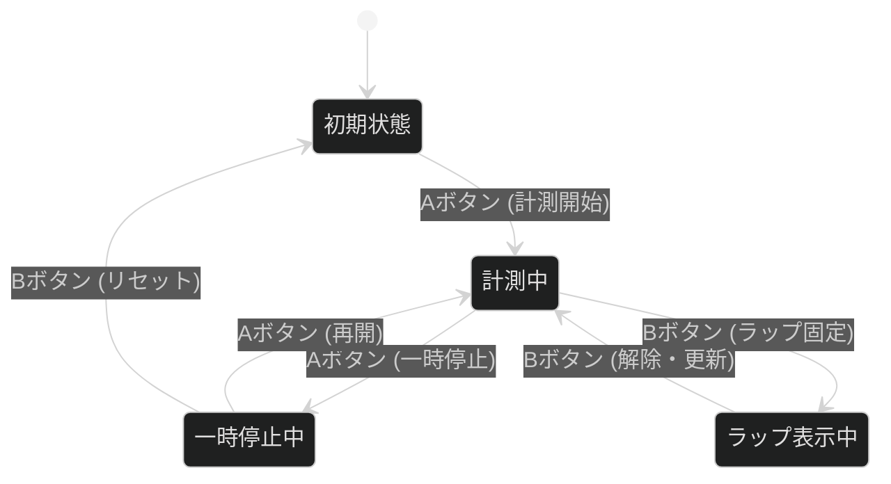

# 状態遷移テストの基礎

## 1. 状態遷移テストとは

**状態遷移テスト**とは、システムの「現在の状態」によって、同じ操作をしても結果や振る舞いが変わる仕組みを検証する技法です。

* **状態（State）：** システムが特定のイベントを待っている継続的な状況（例：ログイン中、貸出中、削除済み）。
* **遷移（Transition）：** ある状態から別の状態へ移り変わること。
* **イベント（Event）：** 遷移を引き起こすきっかけとなる操作や条件（例：ボタン押下、期限の到来）。
* **アクション（Action）：** 遷移の際にシステムが実行する動作（例：エラーメッセージを表示する、メールを送信する）。

> 💡 **テスターの視点**
> 単一の画面確認（点のテスト）ではなく、システム内でのデータの **「一生（ライフサイクル）」** を追いかけます。これにより、「Aボタンを押した後にBボタンを押すとフリーズする」といった、特定の順序で操作したときだけに発生するバグを見つけ出すことができます。

---

## 2. なぜ状態遷移テストが必要なのか？

多くのシステムでは、**「同じ入力でも、状況によって期待値が変わる」** ためです。
以下の表は、スマートフォンの電源ボタンを例にした挙動の違いです。

| 現在の状態 | イベント（操作） | 遷移後の状態 | アクション（結果） |
| --- | --- | --- | --- |
| **電源OFF** | 電源ボタンを長押し | 起動中（ロゴ表示） | 起動バイブレーションが鳴る |
| **画面点灯中** | 電源ボタンを短押し | スリープ状態 | 画面が消灯する |
| **スリープ中** | 電源ボタンを短押し | ロック画面表示 | 画面が点灯する |

このように、状態を意識せずにテストを行うと、「電源ボタンを押せば必ず画面が点灯する」といった誤ったテスト設計をしてしまうリスクがあります。

---

## 3. 状態遷移テストの「2つの武器」

テスト設計を漏れなく行うために、以下の2つの図表を使い分けます。

### ① 状態遷移図 (State Transition Diagram)

システムの全体像を視覚的に把握するための図です。 **「どんな流れがあるか」** を直感的に理解するのに適しています。

### ② 状態遷移表 (State Transition Table)

すべての「状態」とすべての「イベント」を掛け合わせたマトリクス図です。 **「設計漏れ」や「考慮不足」** を見つけるのに非常に強力です。

**例：ECサイトの注文ステータス**
（「ー」は、その操作が起こり得ない、または無視されるケース）

| 状態 ＼ イベント | 注文する | キャンセルする | 発送する |
| --- | --- | --- | --- |
| **未注文** | 注文完了へ | ー | ー |
| **注文完了** | ー | キャンセル済へ | 発送済へ |
| **発送済** | ー | (返品処理へ) | ー |
| **キャンセル済** | ー | ー | ー |

---

## 4. テスト設計のステップ

実際にテストケースを作成する際は、以下のステップで進めます。

1. **「状態」を洗い出す：** システムが留まることができる状況をすべて挙げます。
2. **「イベント」を洗い出す：** 状態を変えるきっかけ（ユーザー操作、時間経過、システムエラーなど）を挙げます。
3. **状態遷移図を書く：** 正解のルート（ハッピーパス）を線で結びます。
4. **状態遷移表を作る：** 行に「状態」、列に「イベント」を配置し、すべての組み合わせを埋めます。
5. **「Nスイッチテスト」の検討：** * **0スイッチ：** 1つの遷移を確認（A→B）
   * **1スイッチ：** 2つの連続した遷移を確認（A→B→C）
   * ※複雑なシステムでは、この「連続操作」で不具合が出やすくなります。

---

## 5. よくある不具合のパターン

状態遷移テストで見つかりやすいバグには傾向があります。

* **不正遷移：** 本来「発送済」からは「キャンセル」できないはずなのに、URLを直接叩くとキャンセルできてしまう。
* **デッドエンド：** ある状態に遷移したら、二度と元の画面に戻れなくなる。
* **イベントの競合：** 「自動タイムアウト」と「保存ボタン押下」が同時に発生した時の挙動不正。

# 実習課題：ストップウォッチの状態遷移テスト設計
## 仕様
このストップウォッチには2つのボタン（**Aボタン**、**Bボタン**）があり、以下の挙動をします。

* **初期状態（00:00:00）**: 停止している状態。
  * Aボタンを押すと、計測を開始する（**計測中**へ）。

* **計測中**: 時間が刻々と進んでいる状態。
  * Aボタンを押すと、計測を一時停止する（**一時停止中**へ）。
  * Bボタンを押すと、その時点のタイムを固定表示する（**ラップ表示中**へ）。※裏では計測が継続。

* **一時停止中**: 計測が止まっている状態。
  * Aボタンを押すと、止まった時点から計測を再開する（**計測中**へ）。
  * Bボタンを押すと、時刻をリセットして初期状態に戻る（**初期状態**へ）。

* **ラップ表示中**: 計測を継続したまま、特定の時点のタイムを表示している状態。
  * Bボタンを押すと、表示を現在の計測時間に更新して計測画面に戻る（**計測中**へ）。

## 課題内容

### ステップ1：要素の洗い出し
* **状態（State）** 
  * 
* **イベント（Event）**
  * 

### ステップ2：状態遷移図の作成

### ステップ3：状態遷移表の作成

### ステップ4：テストケースの作成

# 実習課題：ストップウォッチの状態遷移テスト設計
## 仕様
このストップウォッチには2つのボタン（**Aボタン**、**Bボタン**）があり、以下の挙動をします。

* **初期状態（00:00:00）**: 停止している状態。
  * Aボタンを押すと、計測を開始する（**計測中**へ）。

* **計測中**: 時間が刻々と進んでいる状態。
  * Aボタンを押すと、計測を一時停止する（**一時停止中**へ）。
  * Bボタンを押すと、その時点のタイムを固定表示する（**ラップ表示中**へ）。※裏では計測が継続。

* **一時停止中**: 計測が止まっている状態。
  * Aボタンを押すと、止まった時点から計測を再開する（**計測中**へ）。
  * Bボタンを押すと、時刻をリセットして初期状態に戻る（**初期状態**へ）。

* **ラップ表示中**: 計測を継続したまま、特定の時点のタイムを表示している状態。
  * Bボタンを押すと、表示を現在の計測時間に更新して計測画面に戻る（**計測中**へ）。

## 課題内容

### ステップ1：要素の洗い出し
* **状態（State）** 
  * 初期状態
  * 計測中
  * 一時停止
  * ラップ表示中
* **イベント（Event）**
  * Aボタン
  * Bボタン

### ステップ2：状態遷移図の作成

### ステップ3：状態遷移表の作成
| 状態 ＼ イベント | Aボタン押下 | Bボタン押下 |
| --- | --- | --- |
| **初期状態** | 計測中 |  |
| **計測中** | 一時停止中 | ラップ表示中 |
| **一時停止中** | 計測中 | 初期状態 |
| **ラップ表示中** |  | 計測中 |

### ステップ4：テストケースの作成

### 1スイッチテスト（各状態での単一操作確認）
| ID | 現在の状態 | 操作 | 期待される結果（遷移先） | 備考 |
| --- | --- | --- | --- | --- |
| 1-1 | **初期状態** | Aボタン | **計測中**に遷移し、時間が進み始める。 | 開始操作 |
| 1-2 | **初期状態** | Bボタン | **初期状態**のまま（反応なし）。 | 仕様外動作の防止 |
| 1-3 | **計測中** | Aボタン | **一時停止中**に遷移し、表示が止まる。 | 中断操作 |
| 1-4 | **計測中** | Bボタン | **ラップ表示中**に遷移し、表示が固定される。 | ラップ計測 |
| 1-5 | **一時停止中** | Aボタン | **計測中**に遷移し、止まった位置から再開。 | 再開操作 |
| 1-6 | **一時停止中** | Bボタン | **初期状態**（00:00:00）にリセットされる。 | リセット操作 |
| 1-7 | **ラップ表示中** | Bボタン | **計測中**に戻り、現在の進行時間が表示される。 | ラップ解除 |
| 1-8 | **ラップ表示中** | Aボタン | **ラップ表示中**（変化なし、または仕様により無視）。 | ラップ中の停止は不可 |

### 2スイッチテスト（連続操作によるシナリオ確認）
| ID | シナリオ | 操作手順 | 期待される最終結果 |
| --- | --- | --- | --- |
| 2-1 | **再開・停止サイクル** | A → A → A | 「開始 → 一時停止 → 再開」となり、**計測中**であること。 （一時停止は時間が停止している）|
| 2-2 | **リセット完了** | A → A → B | 「開始 → 一時停止 → リセット」となり、**初期状態**に戻ること。 |
| 2-3 | **ラップ表示と復帰** | A → B → B | 「開始 → ラップ → 解除」となり、**計測中**（最新時間）であること。 |
| 2-4 | **フルサイクル** | A → B → B → A → B | 「開始 → ラップ → 解除 → 停止 → リセット」で**初期状態**に戻ること。 |